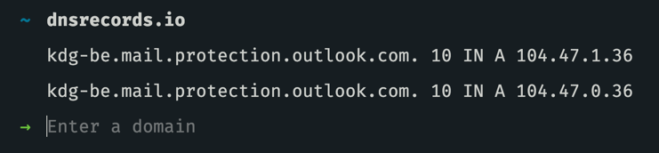

# MX record

Met MX records kan je zeggen waar de mail op je domein moet toekomen. Dus de servers die je mail afhandeling doen.


Zoals bij nameservers ga je bij MX records ook meerdere records instellen om te garanderen dat je mail zeker toekomt.


bvb. voor combell.be

| Hostname | Prioriteit | IP adres |
| :--- | :--- | :--- |
| @ | 10 | mx.mailprotect.be. |
| @ | 50 | mx.backup.mailprotect.be. |

bvb. voor kdg.be

| Hostname | Prioriteit | IP adres |
| :--- | :--- | :--- |
| @ | 10 | kdg-be.mail.protection.outlook.com. |

Je merkt dat er bij kdg.be maar 1 mx record is ingesteld in tegenstelling tot het advies dat we zonet gaven. Dat is omdat ze de backup record mee in de A record hebben geplaatst. Dus dit heeft hetzelfde effect.



De technische notatie van deze records is alsvolgt:

```bash
# voor combell.be
@ IN MX 10 mx.mailprotect.be.
@ IN MX 50 mx.backup.mailprotect.be.

# voor kdg.be
@ IN MX 10 kdg-be.mail.protection.outlook.com.
```

Combell heeft een interessant artikel geschreven over hoe je mx records bij combell kan beheren.



