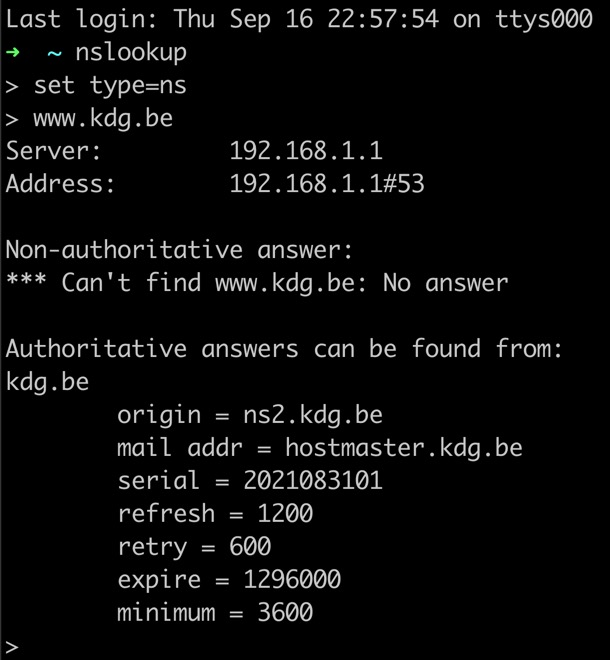
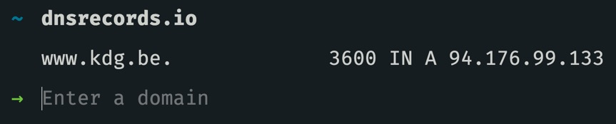
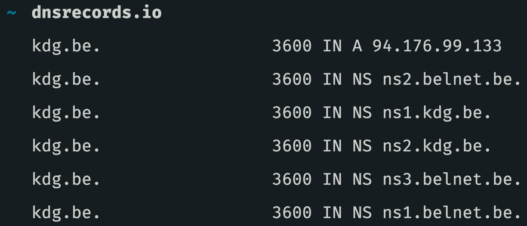

# Name server lookups

## NSLOOKUP

Een name server lookup of nslookup is het opzoeken van technische informatie van een domeinnaam. Dit kan zijn welke name servers een domeinnaam gebruikt maar ook welke records naar welk ip adres gaan.

Een nslookup kan je op elke computer \(mac, windows of linux\) uitvoeren door het commando `nslookup` te gebruiken in de command line interface.


Meer weten over hoe je het nslookup commando moet gebruiken? Check deze [youtube video](https://www.youtube.com/watch?v=jf-x76XYY2o).


## Online DNS lookups

Er zijn ook verschillende manieren om online DNS records op te zoeken. Een super makkelijke website om dit te doen van onze vrienden van [Spatie](https://spatie.be) is [dnsrecords.io](https://dnsrecords.io/).

Daar kan je op de website intypen over welk domein of welke record je meer informatie wilt en dan zullen zij die nslookup voor u doen.


De broncode van de [dnsrecords.io](https://dnsrecords.io) website is ook te vinden op de github van spatie: [https://github.com/spatie/dnsrecords.io](https://github.com/spatie/dnsrecords.io)


## Around the world

