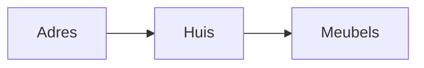
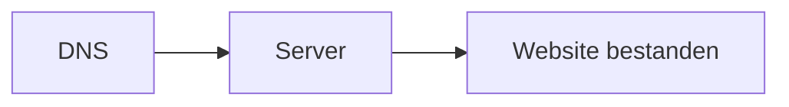

# Ons huis

Vooraleer we beginnen uit te leggen wat Hosting, en alles daarrond, nu juist inhoud. Willen we graag met een analogie duidelijk maken wat hosting is.

Hosting is namelijk zoals een huis 😊

* Een huis heeft een adres, dit is bij hosting de "[DNS Hosting](dns/index.md)".

* Een huis heeft, wel ..., een huis 😅, dit is bij hosting de "Server Hosting".

* Een huis heeft meubels, dit zijn bij hosting dan je website bestanden welke op je server staan.

Als we deze 3 zaken begrijpen en mee kunnen werken zijn we in staat om een website online te zetten.
