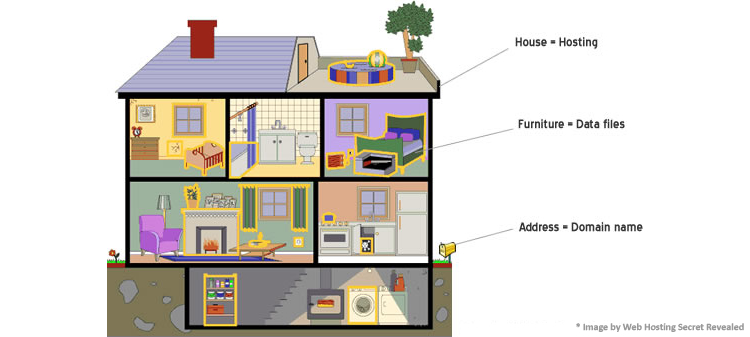

# Wat is web hosting?

Je kan hosting een beetje bekijken zoals een huis.

* Een huis heeft een adres.

* Een huis heeft, wel ..., een huis 😅

* Een huis heeft meubels.

&lt;link to FTP&gt;

Je hebt uiteindelijk dan ook meerdere huizen in een dorp of gemeente.

&lt;link to datacenter&gt;

